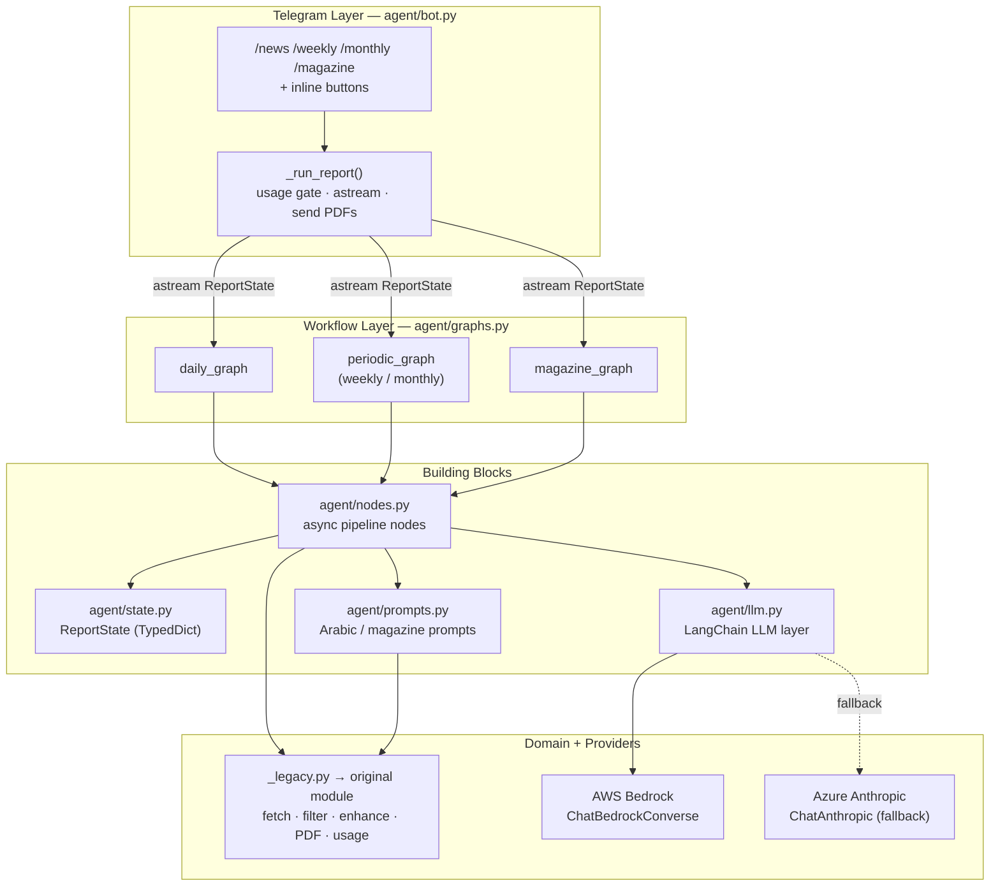
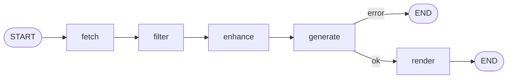
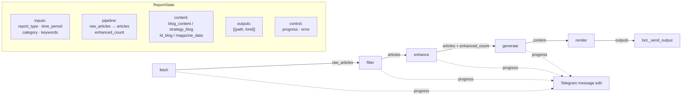
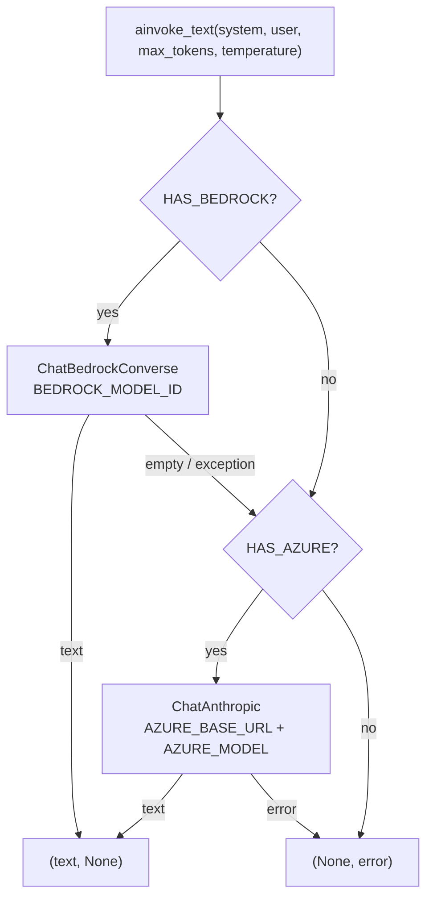
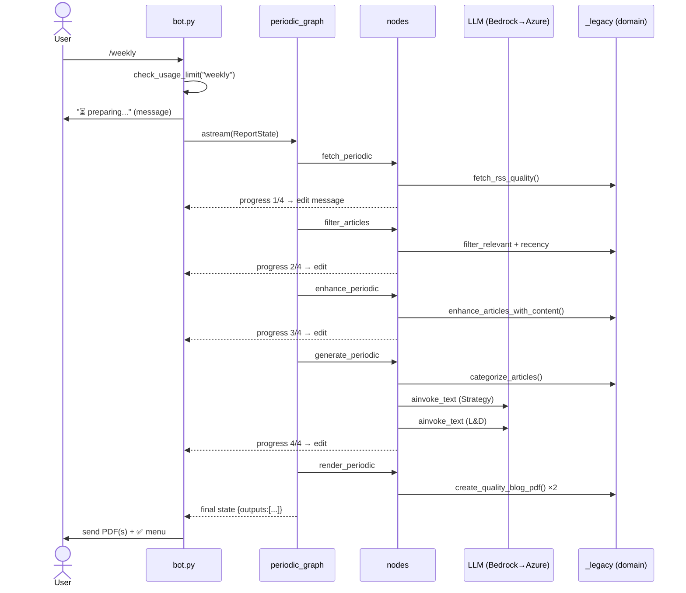
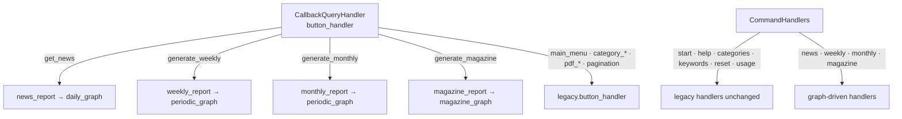

# Quality & Excellence Bot — LangGraph Architecture

The bot is structured as a set of **deterministic LangGraph workflows**. Each
Telegram command maps to a compiled `StateGraph` that runs the same pipeline:

```
fetch → filter → enhance → generate (LLM) → render (PDF)
```

Non-LLM domain logic (scraping, content extraction, PDF rendering, usage
limits, Arabic prompt builders) is reused from the original
`telegram_bot_quality_arabic_claude_version` module via `_legacy.py`.

---

## 1. High-level layers



---

## 2. The workflow graph (shared shape)

All three graphs share the same topology, built by `graphs._build()`. A node
that sets `state["error"]` short-circuits straight to `END`.



| Node | daily_graph | periodic_graph | magazine_graph |
|------|-------------|----------------|----------------|
| **fetch** | `fetch_daily` (NewsAPI + GNews + RSS) | `fetch_periodic` (RSS) | `fetch_periodic` (RSS) |
| **filter** | `filter_articles` (relevance + 60-day recency, fallback) | same | same |
| **enhance** | `enhance_daily` (≤20 articles) | `enhance_periodic` (≤8, weekly/monthly mode) | `enhance_periodic` |
| **generate** | `generate_daily` → Arabic blog markdown | `generate_periodic` → 2 themed blogs (Strategy + L&D) | `generate_magazine` → magazine JSON |
| **render** | `render_daily` → 1 PDF | `render_periodic` → up to 2 PDFs | `render_magazine` → 1 PDF |

---

## 3. State flow (`ReportState`)

A single `TypedDict` threads through every node; each node returns a partial
update that LangGraph merges.



`progress` is set by every node; `bot._run_report` reads it from each
`astream(stream_mode="values")` snapshot and live-edits the Telegram message.

---

## 4. LLM layer (`llm.py`)

Replaces the hand-rolled `call_claude_api`. Same dual-provider behavior, now via
LangChain chat models. Both `invoke_text` and `ainvoke_text` return
`(text, error)`.



---

## 5. Request lifecycle (example: `/weekly`)



---

## 6. Routing & reuse



**LLM-driven generators** run through the graphs; **non-LLM features** (menu,
category browsing, pagination, on-demand PDF buttons, keyword setup, usage/reset)
delegate to the original module so their behavior is unchanged.

---

## 7. File map

| File | Responsibility |
|------|----------------|
| `agent/bot.py` | Telegram entry point; usage gate, graph streaming, PDF sending, routing |
| `agent/graphs.py` | Compiles `daily_graph`, `periodic_graph`, `magazine_graph` |
| `agent/nodes.py` | Async pipeline nodes (fetch/filter/enhance/generate/render) |
| `agent/state.py` | `ReportState` TypedDict |
| `agent/prompts.py` | System/user prompt builders (Arabic blogs + magazine JSON) |
| `agent/llm.py` | LangChain LLM layer (Bedrock primary, Azure fallback) |
| `agent/config.py` | Env-driven config + model IDs |
| `agent/_legacy.py` | Bridge to the original module's domain functions |
| `telegram_bot_quality_arabic_claude_version.py` | Original module — reused domain logic, still runnable standalone |
```
